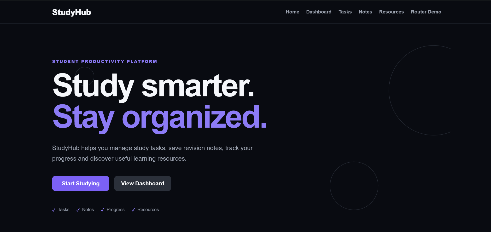
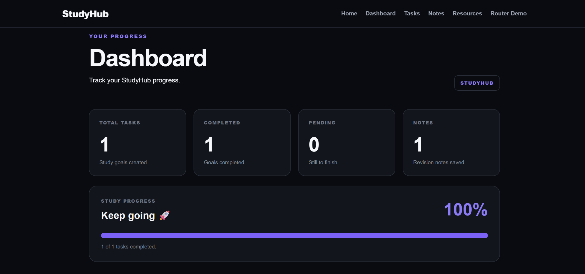
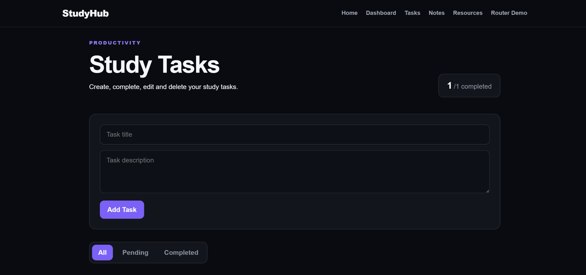
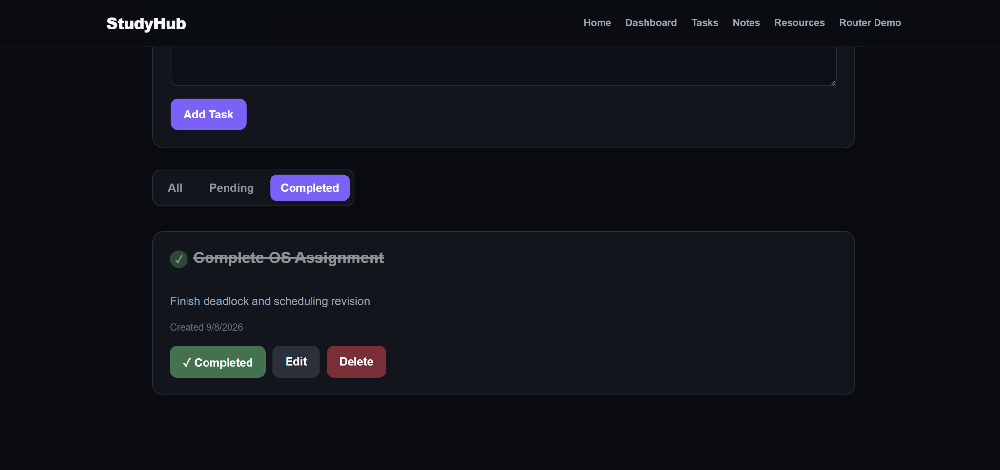
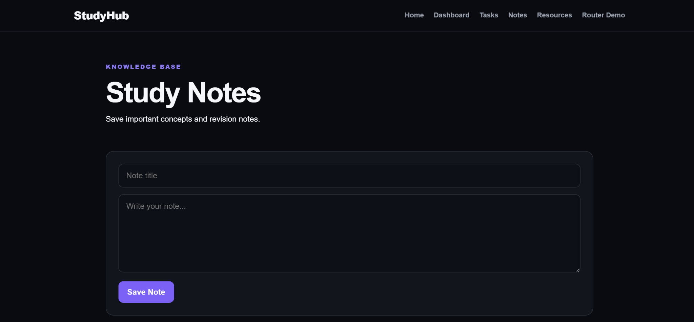
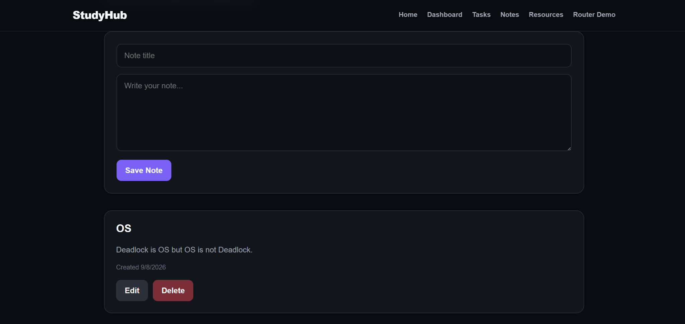
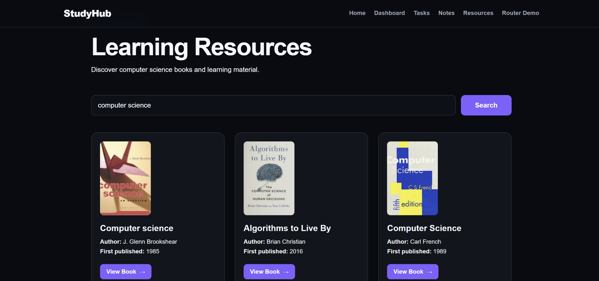
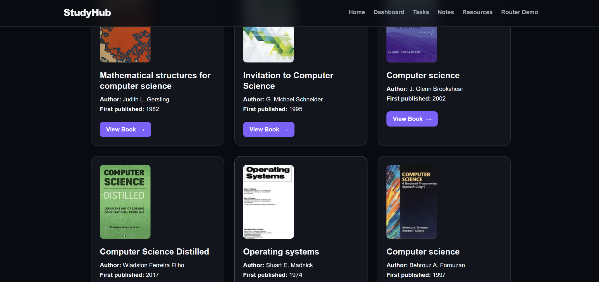
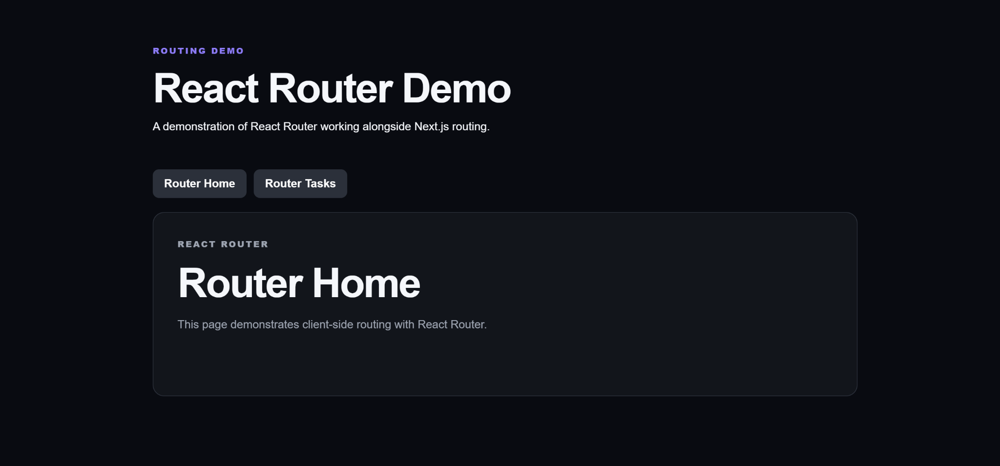

# StudyHub

> A student productivity platform for managing study tasks, revision notes, progress, and learning resources.

StudyHub is a full-stack web application designed to give students a simple and organized workspace for their academic activities.

The project combines a Next.js and React frontend with TypeScript, backend API routes, MongoDB database integration using Mongoose, React Router, and the Open Library public API.

## 🎥 Demo Video

[▶️ Watch the StudyHub Demo on YouTube](https://www.youtube.com/watch?v=EgLFMgyyVbEthese)

## ✨ Features

- 📊 Productivity dashboard
- ✅ Create, view, update, complete, and delete tasks
- 📝 Create, view, edit, and delete revision notes
- 📚 Search for learning resources
- 🌐 Open Library public API integration
- 🔀 React Router demonstration
- 🗄️ MongoDB database persistence
- 🎨 Responsive dark-themed interface
- ⚡ Dynamic data fetching

## 🛠️ Tech Stack

| Technology | Purpose |
|---|---|
| Next.js | Application framework and routing |
| React | User interface and components |
| TypeScript | Type-safe development |
| React Router | Client-side routing demonstration |
| MongoDB Atlas | Database |
| Mongoose | MongoDB object modeling |
| Open Library API | External learning resources |
| CSS | Styling and animations |

## 🏗️ Architecture

StudyHub follows a full-stack architecture where the frontend communicates with backend API routes, which interact with MongoDB through Mongoose.

```text
User Interface
      ↓
React / Next.js
      ↓
Next.js API Routes
      ↓
Mongoose
      ↓
MongoDB Atlas
```

The Resources section uses an external public API:

```text
User Search
      ↓
Resources Page
      ↓
Next.js API Route
      ↓
Open Library API
      ↓
Book Results
```

## 📁 Project Structure

```text
studyhub/
│
├── app/
│   ├── api/
│   │   ├── dashboard/
│   │   ├── notes/
│   │   ├── resources/
│   │   └── tasks/
│   │
│   ├── dashboard/
│   ├── notes/
│   ├── resources/
│   ├── router-demo/
│   ├── tasks/
│   ├── globals.css
│   ├── layout.tsx
│   └── page.tsx
│
├── components/
│   ├── DashboardClient.tsx
│   ├── Navbar.tsx
│   ├── NotesClient.tsx
│   ├── ResourcesClient.tsx
│   └── TasksClient.tsx
│
├── lib/
│   └── mongodb.ts
│
├── models/
│   ├── Note.ts
│   └── Task.ts
│
├── public/
├── screenshots/
├── .gitignore
├── next.config.ts
├── package.json
├── package-lock.json
├── README.md
└── tsconfig.json
```

## 📄 Main Pages

### 🏠 Home

The landing page introduces StudyHub and provides navigation to the main features.

### 📊 Dashboard

The Dashboard provides an overview of productivity using:

- Total tasks
- Completed tasks
- Pending tasks
- Total notes

The statistics are retrieved through the application's dashboard API route.

### ✅ Tasks

The Tasks page provides task management functionality.

Users can:

- Create tasks
- View tasks
- Edit tasks
- Mark tasks as completed
- Delete tasks
- Filter tasks by status

### 📝 Notes

The Notes page provides a space for storing revision material.

Users can:

- Create notes
- View saved notes
- Edit notes
- Delete notes

### 📚 Resources

The Resources page allows users to search for books and learning material using the Open Library public API.

### 🔀 React Router Demo

The Router Demo demonstrates client-side routing using React Router alongside the application's Next.js routing.

## 🔌 API Routes

### Tasks

| Method | Endpoint | Purpose |
|---|---|---|
| GET | `/api/tasks` | Fetch all tasks |
| POST | `/api/tasks` | Create a task |
| PUT | `/api/tasks/[id]` | Update a task |
| DELETE | `/api/tasks/[id]` | Delete a task |

### Notes

| Method | Endpoint | Purpose |
|---|---|---|
| GET | `/api/notes` | Fetch all notes |
| POST | `/api/notes` | Create a note |
| PUT | `/api/notes/[id]` | Update a note |
| DELETE | `/api/notes/[id]` | Delete a note |

### Dashboard

| Method | Endpoint | Purpose |
|---|---|---|
| GET | `/api/dashboard` | Retrieve productivity statistics |

### Resources

| Method | Endpoint | Purpose |
|---|---|---|
| GET | `/api/resources` | Retrieve learning resources |

## 🗄️ Database

StudyHub uses **MongoDB Atlas** for data storage and **Mongoose** for database modeling and operations.

### Task Model

```text
title
description
completed
createdAt
updatedAt
```

### Note Model

```text
title
content
createdAt
updatedAt
```

Both models use timestamps to maintain creation and update information.

## 🌐 External API

The Resources section integrates the **Open Library public API**.

The application uses the API to search for books and display information such as:

- Book title
- Author
- Publication year
- Cover image
- Link to the book

This demonstrates integration with an external public API alongside application-owned database data.

## 📸 Screenshots

### 🏠 Home Page



### 📊 Dashboard



### ✅ Tasks





### 📝 Notes





### 📚 Resources





### 🔀 React Router Demo



## ⚙️ Setup

### Prerequisites

Make sure you have:

- Node.js installed
- A MongoDB Atlas account
- Git installed

### 1. Clone the repository

```bash
git clone https://github.com/ADII6769/STUDYHUB.git
cd STUDYHUB
```

### 2. Install dependencies

```bash
npm install
```

### 3. Configure environment variables

Create a `.env.local` file in the project root:

```env
MONGODB_URI=your_mongodb_connection_string
```

Replace the value with your MongoDB Atlas connection string.

> `.env.local` is excluded from Git so database credentials are not committed to the repository.

### 4. Run the development server

```bash
npm run dev
```

Open the application at:

```text
http://localhost:3000
```

## 🚀 Production Build

Create a production build:

```bash
npm run build
```

Start the production server:

```bash
npm start
```

## 🧠 Learning Objectives

This project demonstrates practical experience with:

- React components
- React state and hooks
- Next.js App Router
- Next.js API routes
- TypeScript
- React Router
- CRUD operations
- MongoDB
- Mongoose
- External API integration
- Client-server communication
- Responsive UI development

## 👨‍💻 Author

**Aditya**

StudyHub was developed as a full-stack web development project to practice modern frontend, backend, database, routing, and API integration concepts.
